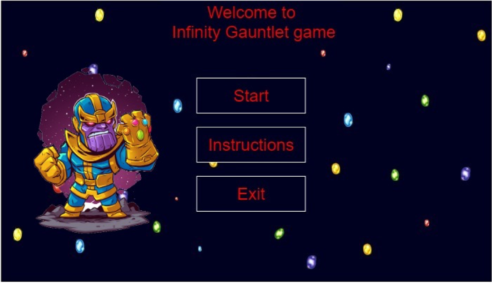
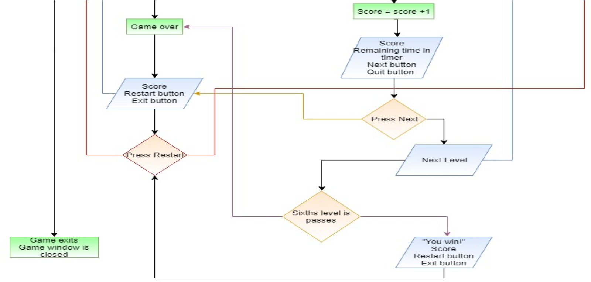

# INFINITY STONES
An interactive game made in Processing language as a project for Computing class

# SCENARIO
Thanos trying to collect all 6 stones into his Infinity Gauntlet by completing a road of pipes to the stones in a maze with a limited time.

# GAME LOGIC
 

# HOW IS IT MADE?
The Infinity Stones game made using idea about characters and items from Marvel Comics and Processing programming language. It has 60fps and embedded library for audio playing.
